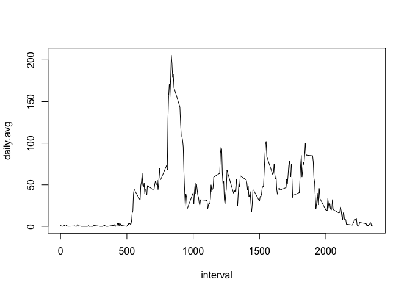

# Reproducible Research: Peer Assessment 1


## Loading and preprocessing the data
First, download and put the csv file in our working directory. Then read the file.

```r
d <- read.csv("activity.csv", header = TRUE)
attach(d)
```
The data is loaded. I will directly use this data frame without any preprocessing.


## What is mean total number of steps taken per day?
I use the aggregate function to find the total number of steps taken per day and make a data frame "day_total" which contains the total number of steps per day.


```r
day_total <- aggregate(list(total.steps = steps), 
                       list(date = date), FUN=sum)
head(day_total)
```

```
##         date total.steps
## 1 2012-10-01          NA
## 2 2012-10-02         126
## 3 2012-10-03       11352
## 4 2012-10-04       12116
## 5 2012-10-05       13294
## 6 2012-10-06       15420
```
Now we will make a histogram of the total number of steps taken each day.

```r
total.steps <- day_total$total.steps
hist(total.steps, breaks = 10)
```

 

Now I will print the mean and median of the total number of steps taken per day.

```r
summary(total.steps)["Median"]
```

```
## Median 
##  10760
```

```r
summary(total.steps)["Mean"]
```

```
##  Mean 
## 10770
```
## What is the average daily activity pattern?
Now I will find the daily activity pattern. I will use the aggregate function. 

```r
pattern <- aggregate(list(daily.avg = steps), 
                     list(interval = interval), 
                     FUN = mean, na.rm = TRUE)
plot(pattern$interval, pattern$daily.avg, 
     type="l", xlab = "interval", ylab = "daily.avg")
```

 

I will also find the interval when the daily average is the maximum.

```r
pattern[which.max(pattern$daily.avg),1]
```

```
## [1] 835
```
## Imputing missing values
Now I will find the total number of missing values in the dataset.

```r
missing <- sum(is.na(steps))
sprintf("Total number of missing values: %s", 
        missing)
```

```
## [1] "Total number of missing values: 2304"
```
Now I will imput values for the na s. I will substitute all the na's with the daily average for that 5-minute interval.

```r
new_df <- data.frame(date= date,
                     interval = interval)

new_steps <- steps
for (i in 1:length(steps))
    { if (is.na(steps[i]))
    {new_steps[i] <- 
        pattern$daily.avg[interval[i]==pattern$interval]}
}
new_df["new_steps"] <- new_steps
head(new_df)
```

```
##         date interval new_steps
## 1 2012-10-01        0 1.7169811
## 2 2012-10-01        5 0.3396226
## 3 2012-10-01       10 0.1320755
## 4 2012-10-01       15 0.1509434
## 5 2012-10-01       20 0.0754717
## 6 2012-10-01       25 2.0943396
```

With this new dataframe I will plot the histogram and time series again.

```r
par(mfrow = c(1,2))
newday_total <- aggregate(list(total.steps = new_steps), 
                          list(date = date), FUN=sum, na.rm=TRUE)
head(newday_total)
```

```
##         date total.steps
## 1 2012-10-01    10766.19
## 2 2012-10-02      126.00
## 3 2012-10-03    11352.00
## 4 2012-10-04    12116.00
## 5 2012-10-05    13294.00
## 6 2012-10-06    15420.00
```

```r
newtotal.steps <- newday_total$total.steps
hist(newtotal.steps, 
     breaks = 10, main = "Imputed values")
hist(total.steps, breaks = 10, 
     main = "Original values")
```

 

```r
summary(newtotal.steps)["Median"]
```

```
## Median 
##  10770
```

```r
summary(newtotal.steps)["Mean"]
```

```
##  Mean 
## 10770
```
We see that the median remains same but the mean increases. We can easily see that there are a lot of values in the left side of the histogram, because we ignored the missing values. But after imputing the missing values the histogram now looks a bell shaped histogram.
## Are there differences in activity patterns between weekdays and weekends?

```r
library(chron)
library(dplyr)
```

```
## 
## Attaching package: 'dplyr'
## 
## The following objects are masked from 'package:stats':
## 
##     filter, lag
## 
## The following objects are masked from 'package:base':
## 
##     intersect, setdiff, setequal, union
```

```r
library(lattice)
new_df$weekdays <- ifelse(is.weekend(new_df$date),
                          "Weekend","Weekday")
head(new_df)
```

```
##         date interval new_steps weekdays
## 1 2012-10-01        0 1.7169811  Weekday
## 2 2012-10-01        5 0.3396226  Weekday
## 3 2012-10-01       10 0.1320755  Weekday
## 4 2012-10-01       15 0.1509434  Weekday
## 5 2012-10-01       20 0.0754717  Weekday
## 6 2012-10-01       25 2.0943396  Weekday
```

```r
daily <- group_by(new_df, interval, weekdays)
daily.data <-  summarise(daily, daily.avg = mean(new_steps))
xyplot(daily.data$daily.avg~ daily.data$interval|daily.data$weekdays,
       type = "l", layout = c(1,2),
       xlab= "interval", ylab = "daily average", 
       main = "weekdays vs weekend")
```

 

